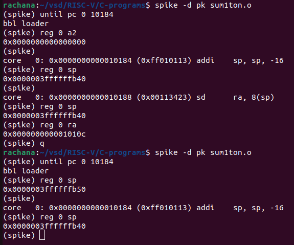
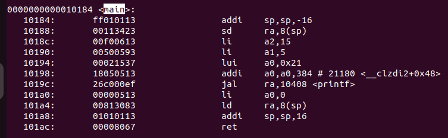
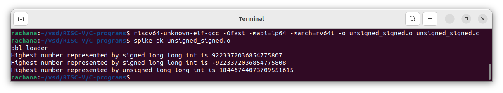

# RISC-V  
[Day 1 - Introduction to RISC-V ISA And GNU compiler toolchain ](#day-1-introduction-to-risc-v-isa-and-gnu-compiler-toolchain)  
[Day 2 - Introduction to ABI and basic verification flow](#day-2---introduction-to-abi-and-basic-verification-flow)  
[Day 3 - Digital Logic with TL Verilog and Makerchip](#day-3---digital-logic-with-tl-verilog-and-makerchip)  
[Day 4 - Introduction to Simple RISC-V Micro Architecture](#day-4---introduction-to-simple-risc-v-micro-architecture)

## Day 1-Introduction to RISC-V ISA And GNU compiler toolchain 
 
<details> 
<summary> Installation of RISC-V tools</summary>  

Steps to install Risc-tools (linux)

```
git clone https://github.com/kunalg123/riscv_workshop_collaterals.git
cd riscv_workshop_collaterals
chmod +x run.sh
./run.sh

```

 Once you run it you will get make error. ignore it  and type the following command

 ```

cd ~/riscv_toolchain/iverilog/
git checkout --track -b v10-branch origin/v10-branch
git pull 
chmod 777 autoconf.sh 
./autoconf.sh 
./configure 
make
sudo make install

```

- To set the PATH variable in .bashrc

```

gedit .bashrc
#Instead of rachana put your username
export PATH="/home/rachana/riscv_toolchain/riscv64-unknown-elf-gcc-8.3.0-2019.08.0-x86_64-linux-ubuntu14/bin:$PATH"
#Type at last line # close the bashrc and type
source .bashrc

```

</details>  
<details>
 <summary>Introduction to Risc-V</summary>  
 The RISC-V Instruction Set Architecture (ISA) is an open and royalty-free instruction set architecture designed for use in computer processors. It is based on the principles of Reduced Instruction Set Computing (RISC), which aims to simplify the processor's instruction set, making it easier to design, implement, and optimize processors. Below is the list of instructions used in Risc-V:  
 
 1.Pseudo Instructions  
 2.Base integer instructions[RV64I]   
 3.Multiple extention instruction[RV64M]  
 4.Single and double floating point instruction (RV64F, RV64D)  
 5.Application binary instruction  
 6.Memory allocation and stack pointer  
 
</details>  
<details>
 <summary>Lab:RISC-V Software Toolchain</summary>  
 Let us take an example [sum1ton.c] to understand how to compile code using RISC-V GCC compiler.  
 
 ```  
 #include <stdio.h>
int main()
{
    int i, sum =0, n=5;
    for(i=1;i<=n;++i)
    {
        sum+=i;
    }
    printf("sum of numbers from 1 to %d is %d \n",n,sum);
    return 0;
}      
```  
Execute the above code using GCC compiler to ensure that the code do not have any issues:  

```  
gcc <filename>  
./a.out
```
Compiling the same code using RISC-V GCC compiler or simulator:  

```
riscv64-unknown-elf-gcc <compiler option -O1 ; Ofast> <ABI specifier -lp64; -lp32; -ilp32> <architecture specifier -rv64i ; -rv32i> -o <object filename> <C filename>
spike pk <object file>
```
Output of the compilation:  

  

To deassemble the object file:  

```
riscv64-unknown-elf-objdump -d <filename>  
```
Use the below command to scroll through the output of object file:  
 
```
riscv64-unknown-elf-objdump -d <filename> | less
```
Use the below command to debug using spike:  
```
spike -d pk sum1ton.o
```
Below are images of debug:  

  
   

</details>

<details>
 <summary>Integer number representation</summary>
 Maximum unsigned number that can be represented by riscv 64 bit is 18446744073709551615 i.e. (2^64 - 1) where as maximum and  minimum signed numbers that can be represented by riscv 64 bit is 9223372036854775807 and -9223372036854775808. The same can be verified using below program: 
 
```  
#include<stdio.h>
#include<math.h>
int main()
{
    long long int max=(long long int)(pow(2,63)-1);
    long long int min=(long long int)(pow(2,63)*-1);
    unsigned long long int unsigned_max=(unsigned long long int)(pow(2,64),-1);
    printf("Highest number represented by signed long long int is %lld \n",max);
    printf("Highest number represented by signed long long int is %lld \n",min);
    printf("Highest number represented by unsigned long long int is %llu \n",unsigned_max);
    return 0;
}
```

Output of the program:  



</details>  

## Day 2 - Introduction to ABI and basic verification flow  
<details>
 <summary>Introduction to Application Binary Interface</summary>    
 
How does the ABI access the hardware resources? 
  - It uses different registers(32 in number) which are each of width `XLEN = 32 bit` for RV32 (~`XLEN = 64 for RV64`) . On a higher level of abstraction these registers are accessed by their respective ABI names.
  
 - In RISC-V architecture, the memories are byte addressable. The RISC-V belongs to the little endian memory addressing system.
  
  For base integer instructions there are broadly 3 types of of such registers:
  - I-type : For instructions having immediate values as operands.
  - R-type : For instructions having only registers as operands.
  - S-type : For instructions used for storing operations.
    
Below is the format of each of these instructions:  

  
Below is the list of 32 registers and their ABI names:  
 

</details>  
<details>  
 <summary>Lab work using ABI function calls</summary>  
 
We try to implement the same program "sum of numbers from 1 to n" in a different method by taking the advantage of ABI interface and function calls.
- There is the main C program containing the code for the summation of numbers from 1 to n.
- We modify it and through the C program we make some funtion calls to the Assembly Language Program trhough the registers a0 and a1.
- We write the assembly language program in the RISC-V ISA and do the computation.
- Finally we send back the final results through the register a0 to the C pogram to get the final output.
  


**Complete Algorithm Flowchart for running the C program using Assembly language**  
  

**Code of Modified custom C program and "load.S" Assembly language program**  

```
#include<stdio.h>
extern int load(int x,int y);
int main()
{
    int result=0, count=9;
    result = load(0x0,count+1);
    printf("sum of nubers from 1 to %d is %d\n",count,result);

}
```

```
.section .text
.global load
.type load, @function
load:
        add a4,a0,zero //initialize sum register a4 with 0x0
        add a2,a0,a1   //store count of 10 in register a2, register a1 is loaded with 0xA(decimal 10) from main
        add a3,a0,zero //initialize intermediate sum register a3 by 0 
loop:   add a4,a3,a4   //incremental addition
        addi a3,a3,1   //increment intermediate register by 1
        blt a3,a2,loop //if a3 < a2, branch to loop named <loop>
        add a0,a4,zero //store the final result to a0 so that it can be read by main program
        ret
```
  - Command used to compile the program is `riscv64-unknown-elf-gcc -Ofast -mabi=lp64 -march=rv64i -o 1to9_custom.o 1to9_custom.c load.S`. 
  - To view to disassemble and view the object file in readable format, we use `riscv64-unknown-elf-objdump -d 1to9_custom.o|less`.
  - To run we use spike which is a RISC-V simulator, following is the command `spike pk 1to9_custom.o`.
  
</details>  
<details>
 <summary>Lab to run c program on RISC-V CPU</summary>  
 
### List of Commands:
1. We clone the RISC-V workshop collaterals repository into our local machine:
`$git clone https://github.com/kunalg123/riscv_workshop_collaterals.git`

2. After downloading is complete, move inside the directory.
`$cd riscv_workshop_collaterals`

3. Move to the labs folder.
`$cd labs`

4. To list the contents of the directory, type : 
`$ls -ltr`

 

5. To view the RISC-V CPU code (for picorv32) written in Verilog :
`$vim picorv32.v` .  This contains the entire verilog netlist.

6. To view the testbench file:
`$vim testbench.v` .  This is where we read the hexfile. Scroll down to see the line : **$readmemh("firmware.hex",memory)**

  

7. To view the standard script of how do we create the hex file :
`$vim rv32im.sh` .  This file contains basically all the necessary set of scripts required to convert the C and Assembly code into hex file and load it into the memory, and then run it. 

8. In order to run this shell script file, we have to change the read/write/execute permissions.
`$chmod 777 rv32im.sh`

9. To run the  script file, type :
`./rv32im.sh`

10. To view the internals of the firmware hex files:
For 64-bit : `$vim firmware.hex`

  

For 32-bit : `$vim firmware32.hex`  


These files shows how the application software is converted into bitstreams and this firmware file is loaded into the memory through the testbench. This file is then processed by the RISC-V core and finally it displays the output results.

**Final Output after running shell script**  

  

</details>

## Day 3 - Digital Logic with TL Verilog and Makerchip  
<details>
 <summary>Introduction to Makerchip IDE</summary>  
 Day 3 of the workshop included the following:

    1. Combinational logic in TL-Verilog using Makerchip
    2. Sequential and pipelined logic
    3. Validity
    4. Hierarchy


An introduction to TL-Verilog was done and we implemented basic combinational and sequential logic using the same.This day finally ended with an implementation of a sequential cyclic calculator. For this, Makerchip IDE, which is an open source tool developed by Redwood EDA has been utilised.
  
  TL-Verilog is an extension for System Verilog, moreover it acts as an higher level abstraction for System verilog which makes HDL implementation very easy and error free. Here we deal the design at a transaction level assuming the design as a pipeline, where inputs would be provided and output will be generated at the end of the pipeline. 
  
  **Advantages** : 
   - Code reduction , and thus less chances of being bug prone.
   - In pipelining ,the flip flops,registers and other staged signals are implied from the context. 
   - It is very easy to stage different sections without impacting the behaviour of the logic.
   - Validity feature which provides easier debugging, cleaner design, automated clock gating and better error checking capabilities.
</details>  
<details>
 <summary>Labs for combinational circuits</summary>   
 
**Inverter using Makerchip**  


**Vector addition**  
  

**Multiplexer**  
  

**Combinational Calculator**  
  

</details>

<details>
 <summary>Labs for Sequential circuits</summary>   
  
 **Fibanocci Series**
   

 **Sequential Calculator**  
    
 This is an extention to the combinational calculator and below is the code:
 ```
/top
      $val1[31:0] = >>1$out[31:0];
      $val2[31:0] = $rand1[3:0];
      $sum[31:0] = $val1[31:0] + $val2[31:0];
      $diff[31:0] = $val1[31:0] - $val2[31:0];
      $prod[31:0] = $val1[31:0] * $val2[31:0];
      $quot[31:0] = $val1[31:0] / $val2[31:0];
      $out[31:0] = $reset ? 32'b0 : (($op[1:0]==2'b00) ? $sum :($op[1:0]==2'b01) ? $diff : ($op[1:0]==2'b10) ? $prod : $quot);
```

</details>  
<details>
 <summary>Pipelined Logic</summary>   
 
Pipelining is a technique used in computer architecture and digital circuit design to improve the overall performance and throughput of a system. It involves breaking down a complex task or process into a series of smaller stages or subtasks, where each stage is performed by a separate component or processing unit. These stages are connected in a pipeline, with each stage working on a different input while the previous stage continues to work on the next input.
 
 **Explanation of pipelining through Pythogorean example**  
   

 **Computing total distance**  
   

 **2 Cycle Calculator**  
 Block Diagram:  
   
 Output in makerchip  
 
 
</details> 
<details>
 <summary>Validity</summary>   
 
Validity is another feature in TL verilog which is asserted if a particular transactions in a pipeline is valid or true. A new scope, called “when” scope is introduced for this and it is denoted as `?$valid`. This new scope has many advantages - easier design, cleaner debug, better error checking and automated clock gating.
Validity provides :
- Easier debug
- Cleaner design
- Better error checking
- Automated Clock gating

**Distance Acculmulator**


  
**2-Cycle Calculator with validity**
  
  
  
   As seen above, apart from the waveforms, The VIZ graphic visualizer was a very helpful tool in Makerchip which helped us analyse and debug our design in case of any functional errors.
  
**Calculator with Single Value Memory**  
  
    
  
</details>  

# Day 4 - Introduction to Simple RISC-V Micro Architecture  
<details>
 <summary>Basic RISC-V CPU microarchitecture</summary>  
 The basic building blocks of RISC-V architecture are :
  
  - Program Counter (PC)
  - Imem-Rd ( Instruction Memory)
  - Instruction Decoder
  - Register File Read
  - Arithmatic Logic Unit (ALU)
  - Register File Write
  - Branch


</details>  
<details>
 <summary>Fetch and Decode</summary>   
 
Here, we are using Makerchip platform to for implementation of RISC-V microarchitechture. The code base can be found [here](https://github.com/Rachana-Kaparthi/RISC-V/blob/main/code/code_base.v)  
 
### Program Counter  


The Program Counter is a crucial component in any computer architecture, including RISC-V, as it is responsible for keeping track of the memory address of the next instruction to be fetched and executed by the CPU.

Here's how the Program Counter works in the RISC-V architecture:

**Fetch Stage:** The Program Counter (PC) holds the memory address of the instruction to be fetched. During the fetch stage of the CPU's pipeline, the instruction located at the address pointed to by the PC is retrieved from memory.

**Incrementing the PC:** After fetching the current instruction, the PC is typically incremented to point to the memory address of the next instruction. This prepares the PC for the next fetch cycle.

**Branch Instructions:** Branch instructions, which are used for conditional jumps or loops, modify the PC. For example, if a branch instruction is taken, the PC is updated to the target address of the branch instruction. If the branch is not taken, the PC is simply incremented to point to the next instruction.

**Jump and Link Instructions:** Jump instructions are used to transfer control to a different part of the program. For example, a jump instruction might be used to call a subroutine. Jump and link instructions (like "jal" in RISC-V) not only modify the PC to jump to a new address but also store the return address (address of the next instruction) in a designated register.

**Interrupts and Exceptions:** In the presence of interrupts, exceptions, or traps, the PC is often saved or modified to handle these events. When an interrupt occurs, the PC is typically saved so that the interrupted program can later resume from where it left off.

**Reset:** During system startup or reset, the PC is initialized to the starting address of the program or the reset handler routine.  
  

**Code for PC Logic:**  
```
|cpu
      @0
         $reset = *reset;
         
         $pc[31:0] = >>1$reset ? 32'b0 : >>1$pc + 32'd4;
         
         
         
      // Note: Because of the magic we are using for visualisation, if visualisation is enabled below,
      //       be sure to avoid having unassigned signals (which you might be using for random inputs)
      //       other than those specifically expected in the labs. You'll get strange errors for these.

   
   // Assert these to end simulation (before Makerchip cycle limit).
   *passed = *cyc_cnt > 40;
   *failed = 1'b0;
```

**Output from Makerchip:**  
  

### Fetch Logic  

**Block diagram of Fetch logic:**  

  

**Code for Fetch logic:**  

```
|cpu
      @0
         $reset = *reset;
         
         $pc[31:0] = >>1$reset ? 32'b0 : >>1$pc + 32'd4;
         
      @1 
         $imem_rd_addr[M4_IMEM_INDEX_CNT-1:0] = $pc[M4_IMEM_INDEX_CNT+1:2];
         $imem_rd_en = !$reset;
         $instr[31:0] = $imem_rd_data[31:0];
         
      ?$imem_rd_en
         @1
            $imem_rd_data[31:0] = /imem[$imem_rd_addr]$instr;   
         
      // Note: Because of the magic we are using for visualisation, if visualisation is enabled below,
      //       be sure to avoid having unassigned signals (which you might be using for random inputs)
      //       other than those specifically expected in the labs. You'll get strange errors for these.

   
   // Assert these to end simulation (before Makerchip cycle limit).
   *passed = *cyc_cnt > 40;
   *failed = 1'b0;
   
   // Macro instantiations for:
   //  o instruction memory
   //  o register file
   //  o data memory
   //  o CPU visualization
   |cpu
      m4+imem(@1)    // Args: (read stage)
      //m4+rf(@1, @1)  // Args: (read stage, write stage) - if equal, no register bypass is required
      //m4+dmem(@4)    // Args: (read/write stage)
   
   m4+cpu_viz(@4)
```
**Output from Makerchip:**  
  

### Decode Logic  
In the decode stage (decode cycle), the fetched instruction is examined and decoded to determine the operation it specifies and the operands involved. This step involves analyzing the opcode (operation code) and other fields in the instruction to understand what operation needs to be performed. Additionally, the decode stage may involve identifying registers or memory addresses associated with the instruction. There are 6 types of instructions in RISC-V :

1. Register (R) type 
2. Immediate (I) type
3. Store (S) type
4. Branch (B) type
5. Upper immediate  (U) type
6. Jump (J) type
   
  
**Code for Decode Instructions**  
```
   //INSTRUCTION TYPES DECODE         
      @1
         $is_u_instr = $instr[6:2] ==? 5'b0x101;
         
         $is_s_instr = $instr[6:2] ==? 5'b0100x;
         
         $is_r_instr = $instr[6:2] ==? 5'b01011 ||
                       $instr[6:2] ==? 5'b011x0 ||
                       $instr[6:2] ==? 5'b10100;
         
         $is_j_instr = $instr[6:2] ==? 5'b11011;
         
         $is_i_instr = $instr[6:2] ==? 5'b0000x ||
                       $instr[6:2] ==? 5'b001x0 ||
                       $instr[6:2] ==? 5'b11001;

         $is_b_instr = $instr[6:2] ==? 5'b11000;
```
**Output in Makerchip**  
   

**Decoding Immediate Instruction**  

Different type of instructions have different fields for storing immediate value which is listed as below:  
  

Code to extract immediate values:  

```
 //INSTRUCTION IMMEDIATE DECODE
         $imm[31:0] = $is_i_instr ? {{21{$instr[31]}}, $instr[30:20]} :
                      $is_s_instr ? {{21{$instr[31]}}, $instr[30:25], $instr[11:7]} :
                      $is_b_instr ? {{20{$instr[31]}}, $instr[7], $instr[30:25], $instr[11:8], 1'b0} :
                      $is_u_instr ? {$instr[31:12], 12'b0} :
                      $is_j_instr ? {{12{$instr[31]}}, $instr[19:12], $instr[20], $instr[30:21], 1'b0} :
                                    32'b0;
```
**Decoding other fields in instruction**  

Based on the type of instruction, there are various other fields like rd,rs1,rs2 registers which has to be decoded. These can be decoded as below:  
  

```
 //INSTRUCTION DECODE
         $rs2[4:0] = $instr[24:20];
         $rs1[4:0] = $instr[19:15];
         $rd[4:0]  = $instr[11:7];
         $opcode[6:0] = $instr[6:0];
         $func7[6:0] = $instr[31:25];
         $func3[2:0] = $instr[14:12];
```

**Output from Makerchip:**  
  

**Final output after decode block is completely implemented:**  


</details>  


## Acknowledgements  
- Kunal Ghosh, VSD Corp. Pvt. Ltd.
- Lasya, Colleage, IIIT B
- Alwin Shaju, Colleague, IIIT B
- chatgpt 

## References  

- https://github.com/RISCV-MYTH-WORKSHOP/RISC-V-CPU-Core-using-TL-Verilog
- https://github.com/alwinshaju08
- https://www.vsdiat.com


